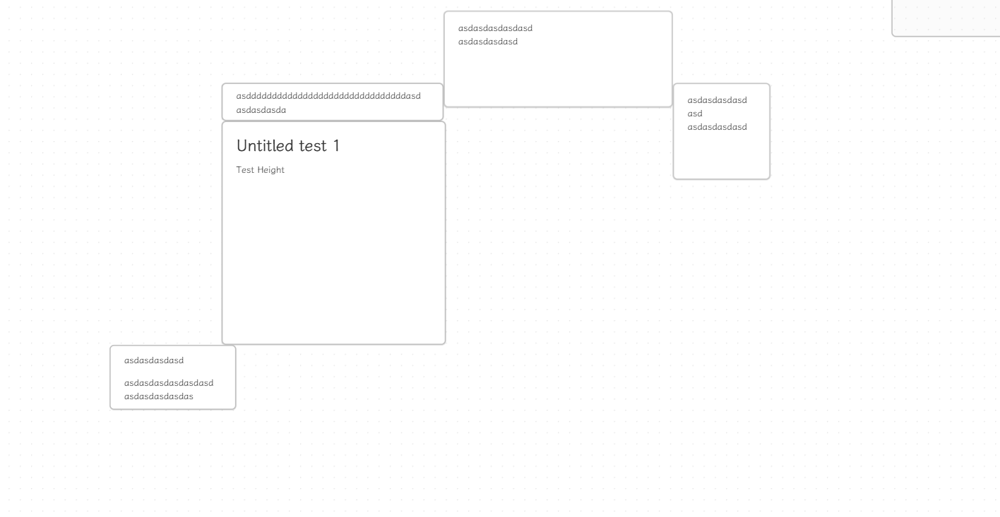

# Canvas Node Auto Resize

An [Obsidian](https://obsidian.md/) plugin that automatically resizes the canvas node to fit its content.

## How to use

1. Install the plugin.
2. Update content in node from canvas view.
3. The node will automatically resize to fit its content.

## Settings

- **Enable width auto resize**;
- **Set the max width**

## Installation

### BRAT

[BRAT](https://github.com/TfTHacker/obsidian42-brat) (Beta Reviewer's Auto-update Tool) is a plugin that allows users to
install Obsidian plugins directly from GitHub with automatic updates.

via Commands:

1. Ensure BRAT is installed
2. Enter the command `BRAT: Plugins: Add a beta plugin for testing`
3. Enter `Quorafind/Obsidian-Node-Auto-Resize`
4. Click on Add Plugin

via Settings:

1. Ensure BRAT is installed
2. Go to *Settings > BRAT > Beta Plugin List*
3. Click on Add Beta plugin
4. Enter `Quorafind/Obsidian-Node-Auto-Resize`
5. Click on Add Plugin

### Manual

Option 1:

1. Go to [Releases](https://github.com/Quorafind/Obsidian-Node-Auto-Resize/releases)
2. Download the latest `Obsidian-Node-Auto-Resize-${version}.zip`
3. Extract its contents
4. Move the contents into /your-vault/.obsidian/plugins/obsidian-Node-Auto-Resize/
5. Go to *Settings > Community plugins*
6. Enable Node Auto Resize

Option 2:

1. Go to [Releases](https://github.com/Quorafind/Obsidian-Node-Auto-Resize/releases)
2. Download the latest `main.js`, `styles.css` and `manifest.json`
3. Move the files into /your-vault/.obsidian/plugins/obsidian-Node-Auto-Resize/
5. Go to *Settings > Community plugins*
6. Enable Node Auto Resize

